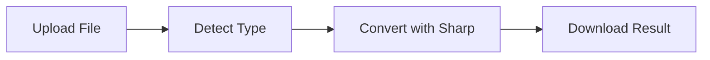

# Veltrix

### Premium File Converter with Brutalist Design

---

## Overview

**Veltrix** is a modern file converter that transforms your images instantly. Built with a striking **brutalist design** inspired by editorial architecture, it combines bold aesthetics with powerful functionality.

**100% Private** - All conversions happen on the server, no third-party APIs  
**Lightning Fast** - Instant conversions with 60fps animations  
**Beautiful Design** - Brutalist aesthetic with smooth GSAP animations

---

## Features

<table>
<tr>
<td width="50%">

### Image Conversion
Convert between popular formats:
- JPG / JPEG
- PNG
- WebP
- GIF

</td>
<td width="50%">

### Premium Experience
- Smooth GSAP animations
- Drag & drop upload
- Real-time preview
- Instant download

</td>
</tr>
</table>

---

## Built With

| Technology | Purpose |
|------------|---------|
| **Next.js 14** | React framework with App Router |
| **TypeScript** | Type-safe development |
| **Sharp** | High-performance image processing |
| **GSAP** | Professional animations |
| **Vercel** | Edge deployment |

---

## Deployment

This project is deployed on **Vercel**. Visit the live site:

**Live URL:** [https://veltrix-file.vercel.app/](https://veltrix-file.vercel.app/)

---

## Design

Veltrix features a **brutalist design** with:

- Bold typography (Space Grotesk)
- Minimal color palette (Beige, Red, Black)
- Asymmetric layouts
- Smooth GSAP animations

---

## How It Works

1. **Upload** - Drag & drop or click to select
2. **Convert** - Server-side processing with Sharp
3. **Download** - Get your converted file instantly

---

## Author

**Shaarim Alam**

---

Made by [Shaarim Alam](https://shaarim.vercel.app)

[Back to Top](#veltrix)

